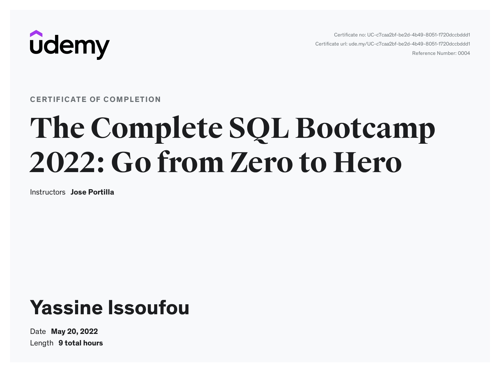

## [The Complete SQL Bootcamp 2022: Go from Zero to Hero](https://www.udemy.com/course/the-complete-sql-bootcamp/)
---

 
Took this course to learn SQL, because I'm interested in Data Science, Data Analytics and Business Analytics. Knowing SQL will help alot with my cs degree or any career I go into. PostgreSQL is one of the most popular DMS for SQL, it's free and open source. I'll use this repo to post all my notes from the bootcamp, and I'll be building pojects in SQL and Python lookout for them on my github. 

 

# What i learned in this course
- Get started with PostgreSQL and PgAdmin: (two of the world's most popular SQL tools)

- Learn basics of SQL syntax

- Analyzing data using aggregate functions with GROUP BY commands

- Running advanced queries with string operations and comparison operations

- Learn to use logical operators to add logic flow to your SQL queries

- Learn common SQL JOIN commands

- Learn to create tables and databases with constraints on data entries

- Learn to use Python to further advanced your SQL skills and much, much more!
---

 

# Certification

This certificate above verifies that Yassine Issoufou successfully completed the course [The Complete SQL Bootcamp 2022: Go from Zero to Hero](https://www.udemy.com/course/the-complete-sql-bootcamp/) on 05/20/2022 as taught by Jose Portilla on Udemy. The certificate indicates the entire course was completed as validated by the student. The course duration represents the total video hours of the course at time of most recent completion.

@github.com/fulanii

